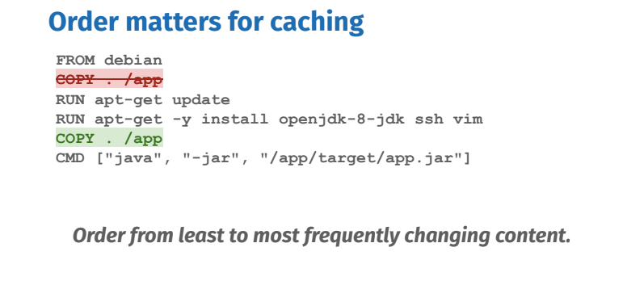

# Лучшие практики по сборке образов

## Порядок имеет значение
Кэширование при сборке работает так: как только на каком-то из шагов нельзя применить кэш, то и все последующие шаги уже не могут браться из кэша.

Поэтому сначала нужно помещать шаги, которые реже всего меняются, а в конце - те, которые меняются часто, например исходный код.

## Копировать только то, что необходимо

По возможности лучше избегать копирования всего. Т.к. любые изменения в любом файле проекта приведут к инвалидации кэша.

## Кэшируемые единицы
`apt-get update & install` - нужно всегда совмещать в одном шаге. Т.к. если закэшируется только шаг обновления индексов, то могут установиться не самые свежие пакеты.

## Удалять кэш пакетных менеджеров
Удалять кэш пакетных менеджеров на том же шаге, что и установка. Если удалять кэш на последующих шагах, то размер образа это не уменьшит

## По возможности использовать официальные образы

В официальных образах уже все оптимизировано. Также их удобнее использовать в качестве базовых образов, если на локальной машине несколько похожих проектов.

## Использовать более точные теги

Если использовать тег `latest`, то есть риск того, что в определенный момент что-то сломается после обновления. К тому же каждый раз после обновления базового образа инвалидируется весь кэш сборки.

## Использовать образы с минимальным размером

## Производить сборку проекта во время сборки образа

Не нужно собирать проект на локальном ПК, а потом копировать все в образ. Вместо этого нужно взять за основу образ, который может собрать проект и собирать проект вместе с образом.

## Скачивание зависимостей отдельным шагом

Это позволит закэшировать скачивание зависимостей, если они не изменялись. Но возникает проблема того, что в итоговом образе сохранятся зависимости для сборки, которые не нужны в Runtime

## Использовать многоступенчатую сборку, чтобы удалить зависимости для сборки

На первой стадии производится установка зависимостей и сборка.
А на второй - копируется в образ только собранный проект без зависимостей.

Многоступенчатую сборку можно распознать по наличию нескольких `FROM`. Каждый  `FROM` начинает новую стадию.

