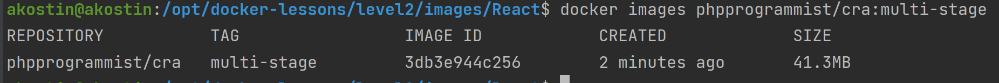

# Многоступенчатая сборка

## React
Рассмотрим [Dockerfile](images/React/Dockerfile) для сборки приложения на React.
```Dockerfile
# 1. Install dependencies only when needed
FROM node:18.0-alpine AS deps
# Check https://github.com/nodejs/docker-node/tree/b4117f9333da4138b03a546ec926ef50a31506c3#nodealpine to understand why libc6-compat might be needed.
RUN apk add --no-cache libc6-compat

WORKDIR /opt/project
COPY package.json yarn.lock ./
RUN yarn install --frozen-lockfile

# 2. Rebuild the source code only when needed
FROM node:18.0-alpine AS builder
WORKDIR /opt/project
COPY --from=deps /opt/project/node_modules ./node_modules
COPY . .
RUN yarn build

# 3. Production image, copy all the files and run next
FROM nginx:1.23-alpine AS runner
WORKDIR /usr/share/nginx/html

ENV NODE_ENV=production

COPY --from=builder /opt/project/build /usr/share/nginx/html
RUN rm /etc/nginx/conf.d/default.conf
COPY nginx/nginx.conf /etc/nginx/conf.d

EXPOSE 80

CMD ["nginx", "-g", "daemon off;"]
```

Каждая стадия начинается с инструкции `FROM`. После ключевого слова `as` указывается название стадии.

На первой стадии (`deps`) происходит копирование файлов пакетных менеджеров устанавливаются зависимости. Если при последующих сборках не будут изменяться зависимости, то результат этой стадии будет браться из кеша и выполняться она не будет.

На второй стадии (`builder`) копируются все зависимости со стадии `deps` и остальной код приложения за счет инструкции `COPY . .`. А потом запускается сборка проекта. Итоговые файлы будут помещены в папку `/opt/project/build`.

На третьей стадии (`runner`) избавляемся от исходного кода, зависимостей и Node.JS. Для этого берем за основу образ `nginx:1.23-alpine`, а не `node:18.0-alpine` как на предыдущих стадиях. 

Копируем готовые статические файлы собранного проекта с предыдущей стадии из папки  `/opt/project/build`, а также конфигурационный файл Nginx.

Открываем 80-й порт и задаем команду, которая выполнится при запуске образа.

Отдельно стоит упомянуть про файл [.dockerignore](images/React/.dockerignore):
```ignore
Dockerfile
.dockerignore
node_modules
.git
```
Это файл позволяет исключить некоторые файлы и папки проекта при копировании их с помощью инструкции `COPY . .`. Конкретный файл позволяет исключить копирование внутрь образа папок `node_modules` и `.git`, что значительно сократит время сборки и размер итогового образа.

Запускается сборка, как обычно: перейти в папку с Dockerfile (`level2/images/React`) и выполнить команду:
```bash
docker build \
    --pull \
    -t phpprogrammist/cra:multi-stage \
    .
```
В Теге укажите свой логин в Docker Hub.

После окончания сборки можно будет просмотреть образы на локальной машине и увидеть парадоксально маленький размер образа:
```bash
docker images phpprogrammist/cra:multi-stage
```


## Стадия, как цель сборки

При обычном запуске сборки в итоговый образ будет попадать только последняя стадия. Но что, если нам необходимо создать образ на основе другой стадии?

Предположим, что нам нужно 2 версии одного образа (prod и dev). Образы имеют минимальные различия - в `dev-сборке` нужен **Xdebug**. Мы могли бы создать 2 отдельных Dockerfile, а можно объединить все в [одном](images/php-fpm/Dockerfile):

```Dockerfile
FROM php:8.1-fpm-alpine as fpm-prod

WORKDIR /opt/project

# Import extension installer
COPY --from=mlocati/php-extension-installer /usr/bin/install-php-extensions /usr/bin/

RUN install-php-extensions amqp apcu bcmath intl oauth opcache pdo_pgsql pgsql redis sockets zip @composer

RUN set -xe \
    && apk update \
    && apk add --no-cache \
        postgresql-dev \
        icu-dev \
        # Необходимо для AMQP
        rabbitmq-c \
        # Необходимо для AMQP
        rabbitmq-c-dev \
        # Необходимо для AMQP
        libssh-dev

FROM fpm-prod as fpm-dev
RUN install-php-extensions xdebug
```

Первая стадия (`prod`) выглядит так, как мы разбирали на [прошлом уроке](../level1/images/php2/Dockerfile).

А вот вторая (`dev`) использует стадию `prod` в качестве базового образа. Далее устанавливаем **Xdebug**. 

Теперь осталось собрать образы, указав нужную стадию в опции `--target`:
```bash
docker build \
    --pull \
    --target fpm-dev\
    -t phpprogrammist/php:8.1-fpm-alpine-dev \
    .

docker build \
    --pull \
    --target fpm-prod\
    -t phpprogrammist/php:8.1-fpm-alpine-prod \
    .
```

Желательно сначала собрать образ по последней стадии, затем предпоследней и т.д. В этом случае будет использоваться кеш.

## Домашнее задание
1) Осуществить сборку образа React-приложения дважды. Замерить время первого и второго билда. Обратите внимание на `---> Using cache`. Попробуйте потом изменить, что-либо в исходном коде приложения, запустите сборку. Посмотрите, какие шаги брались из кеша, а какие нет.
2) Осуществить сборку образов для **PHP-FPM**.