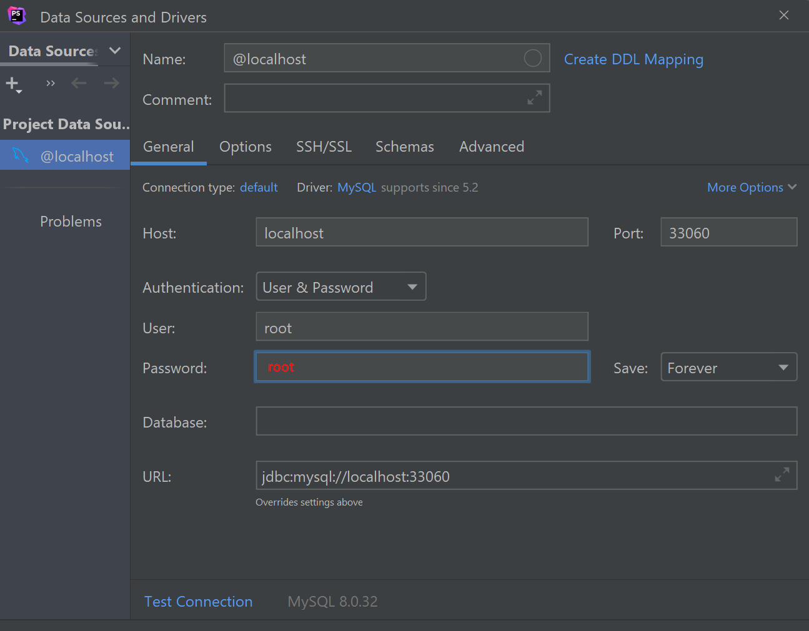
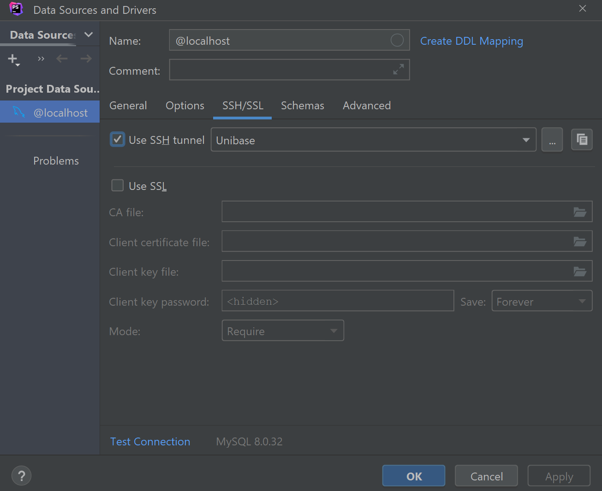

# Порты и сохранение данных

## Порты

Ранее мы использовали контейнеры только путем запуска команд в них (запуская контейнер в интерактивном режиме или сразу запуская нужную команду). Этот способ может использоваться в учебных целях или для запуска консольных команд.

Но, если нам нужно настроить сервер, который будет получать запросы от пользователя и отправлять ему ответ, то нужно использовать другой подход.

К контейнеру, как и к виртуальной машине, можно обратиться через определенный порт. 

По умолчанию, когда контейнер запускается командой `docker create` или `docker run`, то ни один из его портов не открыт внешнему миру. Чтобы это исправить нужно явно указать нужный порт в контейнере и порт хост-машины, с которым он будет связан.

Делается это с помощью опций `--publish` или `-p`.

Например, `-p 8000:80` - свяжет порт `8000` хост-машины и `80-й` порт контейнера.

Если нужно открыть несколько портов, то нужно несколько раз указать эту опцию:
`-p 8000:80 -p 8443:443`.

Если указанный порт хост-машины занят, то получим соответствующую ошибку - `Bind for 0.0.0.0:8000 failed: port is already allocated`.

Перейдем к практике и запустим контейнер Nginx с открытием порта:

```bash
docker run --rm -d --name edge -p 8000:80 nginx:1.23
```

Теперь запросим список запущенных контейнеров с именем `edge`:
```bash
docker ps --filter "name=edge"
```
Обратите внимание на колонку PORTS:
```
0.0.0.0:8000->80/tcp, :::8000->80/tcp
```
В ней указано, что 8000-й порт хост-машины, связан с 80-м портом контейнера. А именно 80-й порт по-умолчанию слушает Nginx. 

Чтобы отправить запрос в Nginx через 80-й порт, нужно отправить его на 8000-й порт хост-машины:
```bash
curl 0.0.0.0:8000
```
В ответ получим HTML, который отдает Nginx.

Также можно обращаться к хост-машине такими способами: `curl 127.0.0.1:8000` или `curl localhost:8000`.

Не забываем останавливать контейнер после того, как он больше не нужен:

```bash
docker stop edge
```

### Как узнать, какой порт контейнера нужно указать?

С помощью опции `-p` мы можем связать любой порт контейнера с любым свободным портом хоста. Но если мы укажем не тот порт, который "слушает" приложение внутри контейнера, то мы и не "достучимся" до приложения (веб-сервера, БД и т.п.). А соответственно мы не получим тот результат, на который мы рассчитывали.

Как же узнать "правильный" порт?

Хорошей практикой при создании образа указывать в Docker файл порт, который нужно будет опубликовать. Делается это с помощью инструкции `EXPOSE`.

Если мы откроем Docker файл официального образа [Nginx](https://hub.docker.com/layers/library/nginx/latest/images/sha256-ae32b34eeb2536cd6ce442209472becbd854de226bb253ec5721e6f9828df595?context=explore), то в 13-й строке увидим:

`EXPOSE 80`

А в Dockerfile [PHP-FPM](https://hub.docker.com/layers/library/php/fpm-alpine/images/sha256-19845ceacced70e8a8784f13db0dc9f2192a3fcf29d5e6a7bb34aeccde186794?context=explore) в 24-й строке:

`EXPOSE 9000`

Инструкция `EXPOSE` не публикует порт автоматически. Она выступает по большей мере в роли документации.

Но, если запустить контейнер с флагом `-P`, то все порты, указанные в `EXPOSE` будут опубликованы. Но при этом они будут связаны с рандомными портами хост-машины, что редко бывает полезно.

Давайте запустим контейнер Nginx, не указывая порт явно:

```bash
docker run --rm -d --name edge -P nginx:1.23
```

Узнать порт хоста можно двумя способами:

1) Командой `docker port`:

```bash
$ docker port edge
#80/tcp -> 0.0.0.0:49153
#80/tcp -> :::49153
```
2) Через `docker ps`:

```bash
docker ps --filter "name=edge"
```
В колонке `PORTS`:

`0.0.0.0:49153->80/tcp, :::49153->80/tcp`.

Но при каждом запуске контейнера порты будут меняться.

Если я сейчас обращусь к этому порту через CURL, то получу дефолтную страницу Nginx:
```bash
curl 0.0.0.0:49153
```
Не забываем останавливать контейнер:

```bash
docker stop edge
```
## Сохранение данных

Как мы уже выяснили ранее, любые изменения в контейнере хранятся в нем до тех пор, пока контейнер не будет уничтожен.

В редких случаях это может быть приемлемо, если в контейнере будут храниться какие-то неважные для нас данные. Но чаще всего мы все же захотим какие-то файлы и папки добавлять в контейнер извне или чтобы наша база данных не обнулялась при перезапуске контейнера.

Есть 2 способа, как сохранять данные вне контейнера.

### Связывание папки (или файла) хост-машины и контейнера (bind)

Первый способ позволяет сделать двухстороннюю между папкой (или файлом) хост-машины и контейнером.

Это значит, что при запуске контейнера в него будет помещена определенная папка и все ее содержимое хост-машины, а также любые изменения, которые контейнер произведет в этой папке будут записаны в папку хост-машины.

Если мы будем изменять/добавлять файлы в связанной папке, то это сразу же отобразится в папке контейнера без необходимости перезапуска. 

Допустим, нам нужно в контейнер Nginx поместить файлы конфигурации и контент, который будет отдавать Nginx при запросе по 80-му порту.

Создайте на своем ПК папку `docker-lessons` и склонируйте в нее данный репозиторий:
```bash
git clone https://github.com/php-programmist/docker-lessons.git .
```
Перейдите в папку `level3/bind-mounts` и просмотрите содержимое папок `config` и `content`. В первой содержатся конфигурационные файлы Nginx, а во второй - статические HTML-файлы.

Теперь выполните команду запуска контейнера с публикацией порта и связанными папками/файлами:
```bash
docker run --rm -d \
  --name edge \
  -p 8000:80 \
  --mount type=bind,source="$(pwd)"/config/nginx.conf,target=/etc/nginx/nginx.conf \
  --mount type=bind,source="$(pwd)"/config/app.conf,target=/etc/nginx/conf.d/app.conf \
  --mount type=bind,source="$(pwd)"/content,target=/usr/share/nginx/html \
  nginx:1.23
```
Либо запустите скрипт `./up.sh`.

Как видим, в команду добавилось 3 опции `--mount`. В нем есть 3 пары "ключ-значение", разделенные запятыми. Пары можно указывать в произвольном порядке.

`type` - тип монтирования. Т.к. мы рассматриваем "связывание", то это `bind`.

`source` - папка или файл на хост-машине. Путь должен быть абсолютным. Поэтому используется переменная "$(pwd)".

`target` - папка или файл в контейнере

Первые две опции монтируют файлы конфигурации, а третья - сразу всю папку `content`.

При монтировании папки, если в целевой папке контейнера были какие-то файлы, то они будут утрачены.

Теперь можно войти в контейнер и проверить содержимое файлов и папок, которые были смонтированы.

```bash
docker exec -it edge sh
cat /etc/nginx/nginx.conf
cat /etc/nginx/conf.d/app.conf
cat /usr/share/nginx/html/index.html
cat /usr/share/nginx/html/about.html
exit
```

Теперь сделаем запросы в контейнер через CURL:
```bash
curl 0.0.0.0:8000
curl 0.0.0.0:8000/about.html
```

Также можно получить список монтированных папок и файлов с помощью команды `docker inspect`:
```bash
docker inspect edge
```
Найдите секцию Mounts:
```json
{
  "Mounts": [
    {
      "Type": "bind",
      "Source": "/opt/docker-lessons/level3/bind-mounts/config/nginx.conf",
      "Destination": "/etc/nginx/nginx.conf",
      "Mode": "",
      "RW": true,
      "Propagation": "rprivate"
    },
    {
      "Type": "bind",
      "Source": "/opt/docker-lessons/level3/bind-mounts/config/app.conf",
      "Destination": "/etc/nginx/conf.d/app.conf",
      "Mode": "",
      "RW": true,
      "Propagation": "rprivate"
    },
    {
      "Type": "bind",
      "Source": "/opt/docker-lessons/level3/bind-mounts/content",
      "Destination": "/usr/share/nginx/html",
      "Mode": "",
      "RW": true,
      "Propagation": "rprivate"
    }
  ]
}
```
Здесь мы видим все 3 монтирования и их конфигурации.

Останавливаем контейнер:
```bash
docker stop edge
```

#### Опция -v

До 2017 года был только один способ монтирования - с использованием опции `-v`. И только потом была добавлена опция `--mount`. Поэтому в старых статьях Вы можете встречать использование опции `-v`. Сейчас же ее не рекомендуют использовать - у нее упрощенный синтаксис, но он неявный:

`-v "$(pwd)"/config/nginx.conf:/etc/nginx/nginx.conf` - сначала указывается путь в хост-машине, а после `:` - путь в контейнере.

Т.о. запустить Nginx можно и таким образом:
```bash
docker run --rm -d \
  --name edge \
  -p 8000:80 \
  -v "$(pwd)"/config/nginx.conf:/etc/nginx/nginx.conf \
  -v "$(pwd)"/config/app.conf:/etc/nginx/conf.d/app.conf \
  -v "$(pwd)"/content:/usr/share/nginx/html \
  nginx:1.23
```

Еще одно отличие `-v` от `--mount`: если папка хост-машины, которая монтируется, отсутствует, то при использовании `-v` она создастся, а при использовании `--mount` - получим ошибку.

### Тома Docker (Volume)
В некоторых случаях у нас не будет необходимости помещать в контейнер какие-либо файлы и папки, но при этом нам нужно, чтобы данные добавленные/измененные внутри контейнера хранились и после уничтожения контейнера. В частности, такой подход применим для контейнеров баз данных.

Для этого можно использовать Docker Том. 

Том — это файловая система, которая расположена на хост-машине за пределами контейнеров. Созданием и управлением томами занимается Docker. Вот основные свойства томов Docker:

* Они представляют собой средства для постоянного хранения информации.
* Они самостоятельны и отделены от контейнеров.
* Ими могут совместно пользоваться разные контейнеры.
* Они позволяют организовать эффективное чтение и запись данных.
* Тома можно размещать на ресурсах удалённого облачного провайдера.
* Их можно шифровать.
* Им можно давать имена.
* Контейнер может организовать заблаговременное наполнение тома данными.
* Они удобны для тестирования.

#### Команды управления томами:

Создать том с названием `my_volume`:
```bash
docker volume create --name my_volume
```
---
Список томов:
```bash
docker volume ls
```
---
Получение информации о томе с названием `my_volume`:
```bash
docker volume inspect my_volume
```
В ключе "Mountpoint" хранится путь, где физически хранятся данные тома.

---
Удалить том:
```bash
docker volume rm my_volume
```
Удалить том, который связан с контейнером (даже с незапущенным), не получится.

---
Удалить все тома, которые не используются контейнерами:
```bash
docker volume prune
```
---

Монтирование тома осуществляется также с помощью опций `--mount` или `-v`:

`--mount type=volume,source=my_volume,target=/path/in/container`

`type=volume` - теперь используем другой тип `volume`

`source=my_volume` - здесь указываем имя тома

`target=/path/in/container` - тут путь в контейнере, куда монтируется том.

И вот синтаксис для `-v`:

`-v my_volume:/path/in/container`

Кстати, если запустить контейнер, указав для монтирования несуществующий том, то он будет автоматически создан.

В отличие от монтирования связыванием, при монтировании несуществующего тома, если в целевой папке в контейнере есть какие-то файлы, то они будут помещены в том, а не удалены.

Запустим контейнер с MySQL, примонтировав в него несуществующий том `db_volume`.
```bash
docker run --rm -d \
  --name db \
  -e MYSQL_ROOT_PASSWORD=root \
  --mount type=volume,source=db_volume,target=/var/lib/mysql \
  mysql:8.0
```

После запуска контейнера можем проверить наличие тома `db_volume`:
```bash
docker volume inspect db_volume
```

А также просмотреть монтирования контейнера:
```bash
docker inspect db 
```
```json
{
  "Mounts": [
    {
      "Type": "volume",
      "Source": "db_volume",
      "Target": "/var/lib/mysql"
    }
  ]
}
```
---
Попробуйте удалить том:
```bash
docker volume rm db_volume
```
Получим ошибку о том, что том используется.

---
Остановите контейнер и удалите том:
```bash
docker stop db && docker volume rm db_volume
```

### Инструкция VOLUME в Dockerfile

Ранее при знакомстве инструкциями Dockerfile, Вы могли наткнуться на инструкцию `VOLUME`.

В ней можно указать папку внутри контейнера, из которой будет создаваться анонимный том при каждом запуске контейнера. И при каждом запуске - это будет новый том, который не содержит изменений из прошлого запуска.

Если же мы запускали контейнер с флагом `--rm`, то этот анонимный том будет удаляться вместе с контейнером.

В общем, эта инструкция явно работает не так, как ожидается, и от нее больше вреда, чем пользы!

Поэтому лучше **избегать использования** этой инструкции в Dockerfile!

## Домашнее задание
1) Запустите контейнер MySQL, используя монтирование связыванием (`bind`). Войдите в контейнер (https://hub.docker.com/_/mysql), создайте базу данных, таблицу и добавьте в нее пару строк. Потом остановите контейнер, запустите заново и убедитесь, что данные после перезапуска не были утрачены.
2) Попробуйте открыть для MySQL порт на хост-машине, а затем подключиться к этому порту через PHPStorm (WebStorm). Возможно, вам понадобится настроить SSH-туннель.



